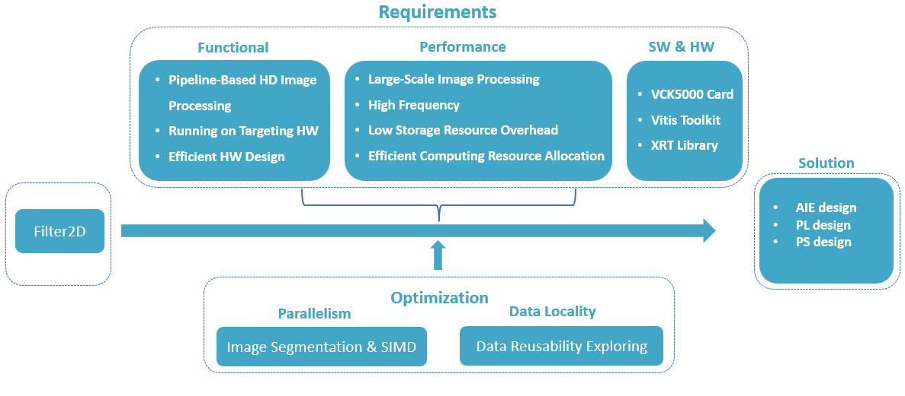
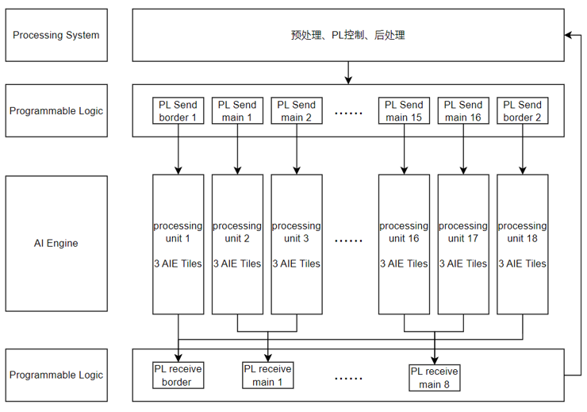
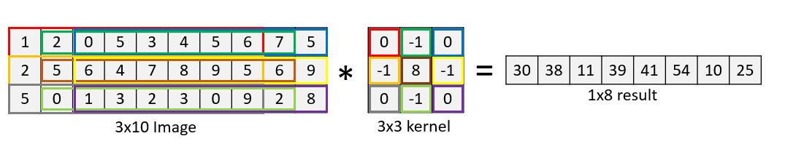
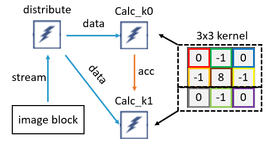
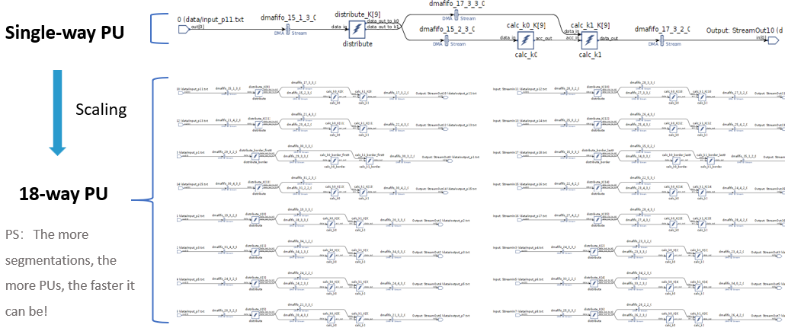
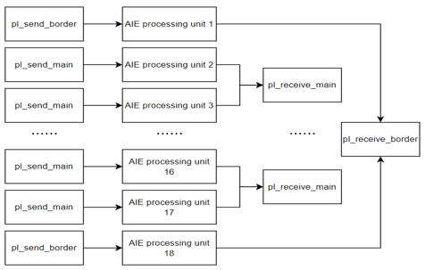
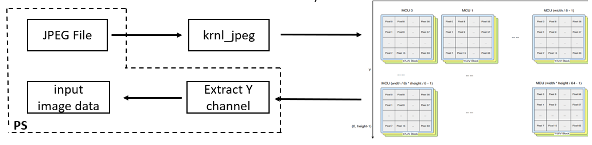
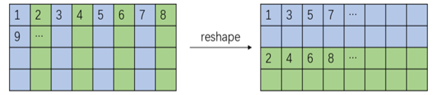
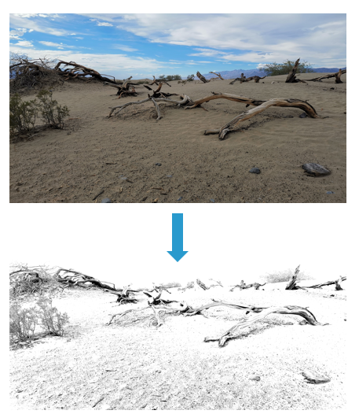

# CCFSys 2023 - First Prize - BJUT

## Filter-2D accelerator design based on VCK5000

> University：北京工业大学(BJUT)
> 
> Mentor：张文博老师(Wenbo Zhang)、包振山老师(Zhenshan Bao)
> 
> Team：刘一祺（Yiqi Liu）、王天硕（Tianshuo Wang）、李一鸣（Yiming Li）

 ## Problem

- Basic  - 1024-Point FFT Single Kernel Programming

    The basic requirement is to complete a 1k-Point FFT design based on  personal understanding using AIE API or AIE Intrinsic. 

    - AIE Emulation succeeded
    - The design report submitted

- Advanced  - Explore very large point FFT (8k ~ 64k points) design on VCK5000 

    - The system level emulation or the hardware run on VCK5000 succeeded
    - The design report submitted

## Solution

- We combine the advantages of platform hardware, consider the characteristics of Filter2D itself, and design AIE by improving processing parallelism and data locality, and give our design scheme.

    - To enhance parallelism, we decomposed the original problem into numerous identical subtasks that can be processed simultaneously, By doing so, we can maximiz the utilization of the parallel advantages of the AIE architecture and leverage the SIMD characteristics.

    - To improve data locality, we have focused on improving the reusability of data within processing units from an algorithmic perspective.  We have utilized cascaded data flow and broadcasting mechanisms to increase data utilization.

- By implementing these optimization methods, we aim to achieve higher performance and efficiency in the implementation of the Filter2D function on the VCK5000 platform.

## System architecture
The AIE part is the core of our design, and the whole system architecture is shown in the image.

The AIE is responsible for the core computations of convolution. We used18 processing units in parallel for convolution computation, with each processing unit consisting of 3 AIE kernels. Therefore, a total of 54 AIE kernels were used. And each AIE tile can do 8-channel multiplication operations with the support of the vector processor.

For the PL side, we utilized two kernel services, named PL_SEND and PL_RECEIVE, to handle the input and output data of the AIE processing units. 

On the PS side, we utilized XRT (Xilinx Runtime) for runtime control of the system.

This architecture allowed us to achieve efficient and parallel computation for the convolution operations, contributing to the overall performance of our system.

## AI-Engine (AIE) design
###AIE::Vector

The key computational logic of the AIE is utilizing the vector processor to perform 8-way Int32 parallel operations.

In this image, a 3x10 input image is divided into 9 vectors, each containing 8 Int32 elements, as indicated by the boxes of different frame color. 

These 9 vectors correspond to the 9 weights in the 3x3 convolution kernel. By leveraging the vector processor, we can perform multiplication operations between the image and the corresponding parts of the convolution kernel, indicated by the same color. 

During the multiplication process, the ACC (accumulator) is used for result accumulation, enabling simultaneous computation of 8 convolution results.

###AIE::Kernel

After vectorizing the convolution computation, we can design the corresponding AIE kernels. To achieve efficient computation, we split the convolution calculation into two parts. The K0 kernel is responsible for two-thirds of the convolution workload, while the K1 compute core handles one-third of the workload. The ACC is cascaded between them, and the overall processing is performed in a well-designed pipelined manner.

Since the two compute cores have different data requirements after the split, we add a distribute kernel to pass the data needed by the two compute kernels. We named this entire unit as a processing unit, which was able to conduct all convolution operations. However, to improve speed, we can split the image into multiple parts and run multiple processing units simultaneously.

###AIE::Graph

Once we have a singe processing unit and confirm the image segmentation, we can scale the process units. In our current design, to tackle the challenge of final round, we used 18 processing units.

Increasing the number of image blocks during partitioning will result in more processing units and shorter computation time. However, it is important to consider the hardware resource limitations, as a larger number of processing units will require more AIE cores.

When determining the optimal number of processing units, it is crucial to strike a balance between computational efficiency and resource utilization. The hardware resources, such as the number of available AIE kernels, should be carefully considered to ensure the system can handle the increased workload effectively and efficiently.

## Programmable Logic (PL) design

Once the AIE design is completed, we turn to the design of the PL. The PL kernels can be divided into two groups----those that interact with the AIE and those that do not. Let's start by discussing the PL cores that interact with the AIE which are PL_SEND and PL_RECEIVE.

PL_SEND takes the main role of transferring data to the AIE processing units, providing a one-to-one service for each AIE processing unit. On the other hand, PL_RECEIVE is responsible for receiving data from the AIE, providing a one-to-two service for each PL_RECEIVE core, capable of receiving data from two AIE processing units.

Another type of PL core that interacts with the AIE is the JPEG image decoding core based on the Vitis library. This core requires reading the binary data of the input image from the PS side and, after calling this kernel, extracting the Y channel as the input image.

## Host (PS) design

Once the PL design is completed, the PS side can be used for flow control. The PS is responsible for tasks such as reading the binary data of the image, image segmentation, PL runtime control, reshaping of execution results, and collecting runtime information.

One of the more complex function of the PS design is image reshaping. Since the output data from PL_RECEIVE is interleaved, it needs to be reshaped into sequential order to be used as the output result.

## Performance Analyzer

By applying development process just mentioned, we have achieved impressive results. The system is capable of processing images with a resolution of up to 8K (7680x4320) resolution. The average processing time for an 8K image is 9.82 milliseconds, with an average frame rate of 101.87 FPS.  Additionally, the resolution range specified in the competition task was from HD to 4K, while our design is capable of handling 8K resolution.

The two images on the right-hand side show the input image and the processed image. The input image is based on the "sand" image from the VCK5000 official example, and we have used tools to upscale its resolution to 8K.

